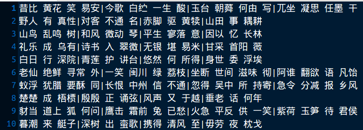
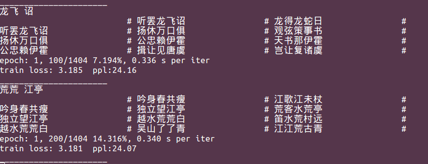
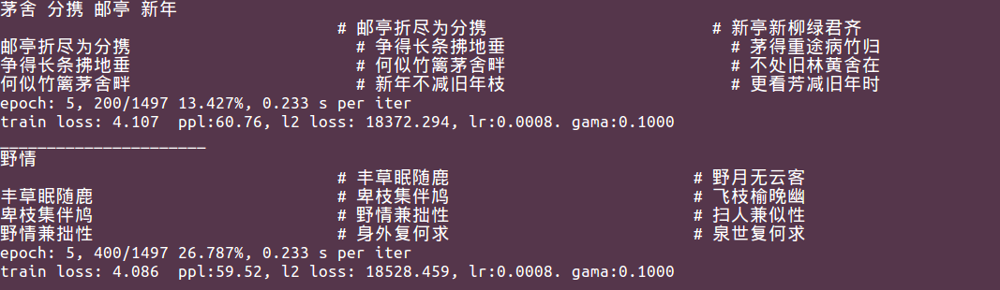
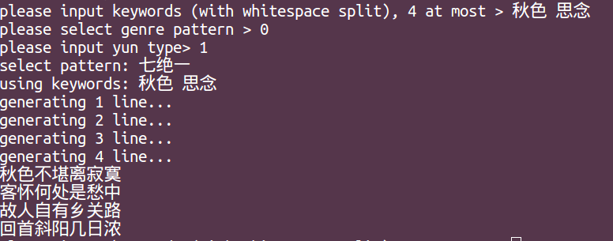

# WMPoetry
The source code for [*Chinese Poetry Generation with a Working Memory Model*](https://www.ijcai.org/proceedings/2018/0633.pdf) (IJCAI 2018).

## 0. Notice
* We update the environment from python 2.7 & Tensorflow 1.4 to python 3.6.5 & Tensorflow 1.10.
* The source code has been reconstructed in a better coding style.
* We also improve several implementation details.

## 1. Rights
All rights reserved.
## 2. Requirements
* python==3.6.5
* TensorFlow==1.10

## 3. Data Preparations
To train the model and generate poems, we provide some necessary data files as follows:

* A rhyme dictionary. We use *cilinzhengyun* (《词林正韵》) instead of pingshuiyun (《平水韵》).
* The stop words files.
* A tf-idf file, which contains pre-calculated tf-idf values.
* The Ping (level) tone dictionary and Ze (oblique) tone dictionary.
* A human-checked high-quality words file.
* A genre pattern file for quatrains.

We also provide a small corpus with 25,000 Chinese quatrains for testing this code.

All these data files are avaliable [here](https://drive.google.com/drive/folders/1YrIC9hUAZ1LRceRPXnpsdtorjIrvJeQy?usp=sharing).

You can also use your own data.

## 4. Preprocessing

### 4.1. Word Segmentation

At first, one needs to move all the downloaded files to WMPoetry/preprocess/data/, then to segment the corpus with any released segmentation tool. Then save the poems with whitespace separating words and with '|' separating sentences. The segmented corpus file should look like:



In this file, each line is a poem. The provided small corpus has been segmented with our own poetry segmentation tool.

### 4.2. Keywords Extraction and Genre Pattern Building
At first, one needs to manually divide the whole corpus file into training file, validation file and testing file. For example, we use 2,3000 poem in our small corpus as the training file, train.txt and 1,000 as the validation file, valid.txt and 1,000 as the testing file, test.txt.

We provide a script to extract keywords and build genre pattern, **only for Chinese quatrains**. For other genres, such as lyrics and Song iambics, the scripts will be released in the future.

Put the segmented corpus file (e.g., train.txt, valid.txt and test.txt) into WMPoetry/preprocess/, then in WMPoetry/preprocess/, run:
```
python preprocess.py --inp valid.txt --out valid_keys.txt
python preprocess.py --inp test.txt --out test_keys.txt
python preprocess.py --inp train.txt --out train_keys.txt --cl 1
```
One can get the processed files: train_keys.txt, valid_keys.txt and test_keys.txt.

NOTE: By running preprocess.py on the training file (train.txt), one can also get a file, DuplicateCheckLib.txt (by setting --cl as 1), which contains all different lines in the training set. When generating poems, we will remove the generated candidates which are already in DuplicateCheckLib.txt. This DuplicateCheckLib.txt is also used to build the dictionary.

### 4.3. Binarization

If there isn't pre-trained word embedding or corresponding dictionary files, please first build the dictionary in WMPoetry/preprocess/, by:
```
python build_dic.py -i DuplicateCheckLib.txt -m 3
```
and one can get the dictionary file and inverting dictionary file, vocab.pickle and ivocab.pickle. We only keep the characters which occur more than -m times.

Then, binarize training data and validation data:
```
python binarize.py -i valid_keys.txt -b valid.pickle -d vocab.pickle
python binarize.py -i train_keys.txt -b train.pickle -d vocab.pickle
```

### 4.4. Before Training and Generation

Before training and generation, please:
1. move test_keys.txt to WMPoetry/wm;
2. move train.pickle, valid.pickle, vocab.pickle and ivocab.pickle to WMPoetry/wm/train/;
3. move pingsheng.txt, zesheng.txt and cilinList.txt to WMPoetry/wm/other/;
4. move DuplicateCheckLib.txt, GenrePatterns.txt and fchars.txt to WMPoetry/wm/other/.

## 5. Training
In WMPoetry/wm, please edit the **config.py** at first to set the configuration, such as hidden size, embedding size, data path, model path, GPU and so on. By default, all data files are saved in WMPoetry/wm/data, and the model files & the pre-trained model files (checkpoints) are saved in WMPoetry/wm/model/ & WMPoetry/wm/premodel/.

### 5.1. Pre-Training
We recommend one to pre-train the encoder, decoder and embeddings by training a simple sequence-to-sequence model, which would stabilize the training of the working memory model. In WMPoetry/wm, run:
```
python pretrain.py
```
Some training information is outputed as:



One can also check the saved training information in trainlog.txt. By default, the pre-trained model files are stored in WMPoetry/wm/premodel/.

### 5.2. Training
In WMPoetry/wm, run:
```
python train.py
```

The model will load pre-trained parameters of the encoder, decoder and embeddings from the checkpoints in the premodel path. If one doesn't need pre-training, please set:
```
self.__use_pretrain = False
```
in the 20-th line of train.py. 

During the training process, some training information is outputed as:



## 6. Generation
We provide two interfaces of poetry generation.

The first one is an interactive interface. In WMPoetry/wm, run:
```
python gen_ui.py -t single -b 20
```

Then one can input keywords, select the genre pattern and rhyme:



One can also set a specific checkpoint as:
```
python gen_ui.py -t single -b 20 -m model/poem.ckpt_4-5988
```

The second interface is to generate poems according to the whole testing file:
```
python gen_ui.py -t file -b 20 -i test_keys.txt -o output.txt
```
## 7. System
This work has been integrated into THUNLP automatic poetry generation system, **Jiuge (九歌)**, which is available via https://jiuge.thunlp.cn. 

<div align=center></div>

## 8. Citation
 Xiaoyuan Yi, Maosong Sun, Ruoyu Li, Zonghan Yang. Chinese Poetry Generation with a Working Memory Model. *In Proceedings of the Twenty-Seventh International Joint Conference on Artificial Intelligence*, pages 4553–4559, Stockholm, Sweden, 2018.

The bib format is as follows:
```
@inproceedings{Yimemory:18,
    author  = {Xiaoyuan Yi and Maosong Sun and Ruoyu Li and Zonghan Yang},
    title   = {Chinese Poetry Generation with a Working Memory Mode},
    year    = "2018",
    pages   = "4553--4559",
    booktitle = {Proceedings of the Twenty-Seventh International Joint Conference on Artificial Intelligence},
    address = {Stockholm, Sweden}
}
```

## 9. Contact
If you have any questions, suggestions or bug reports, please feel free to email yi-xy16@mails.tsinghua.edu.cn or mtmoonyi@gmail.com.
